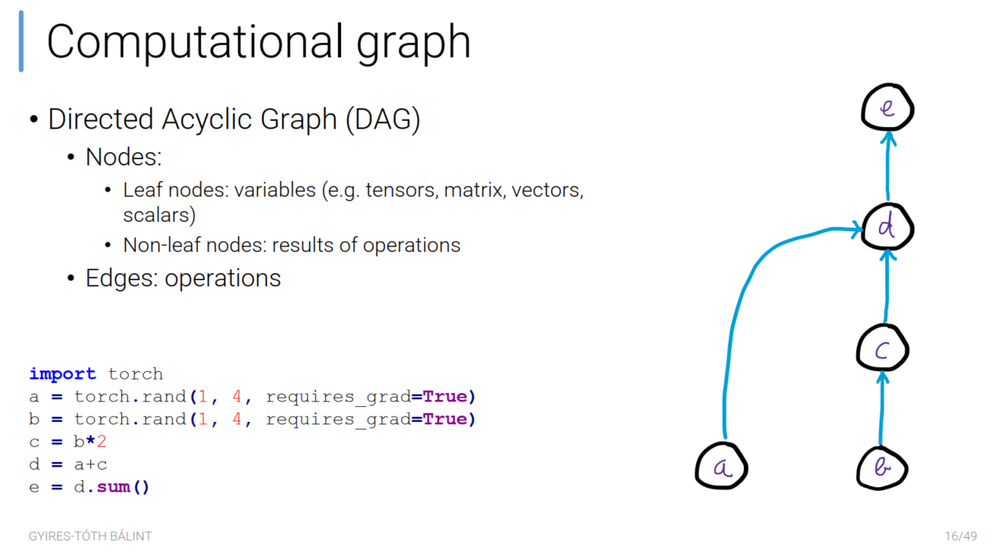
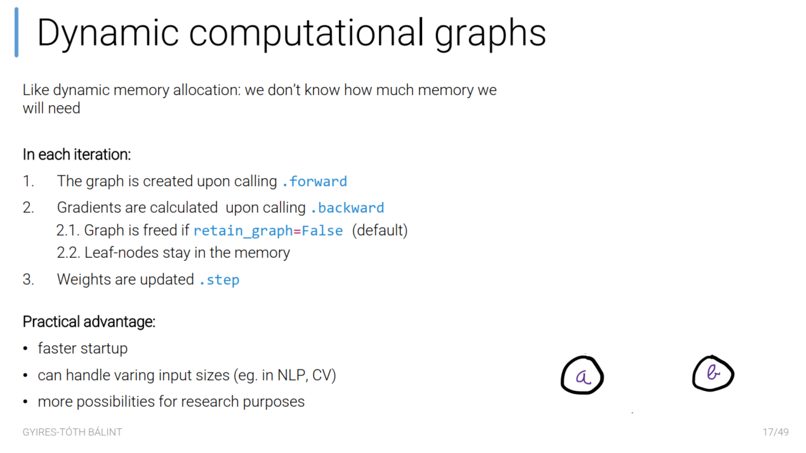
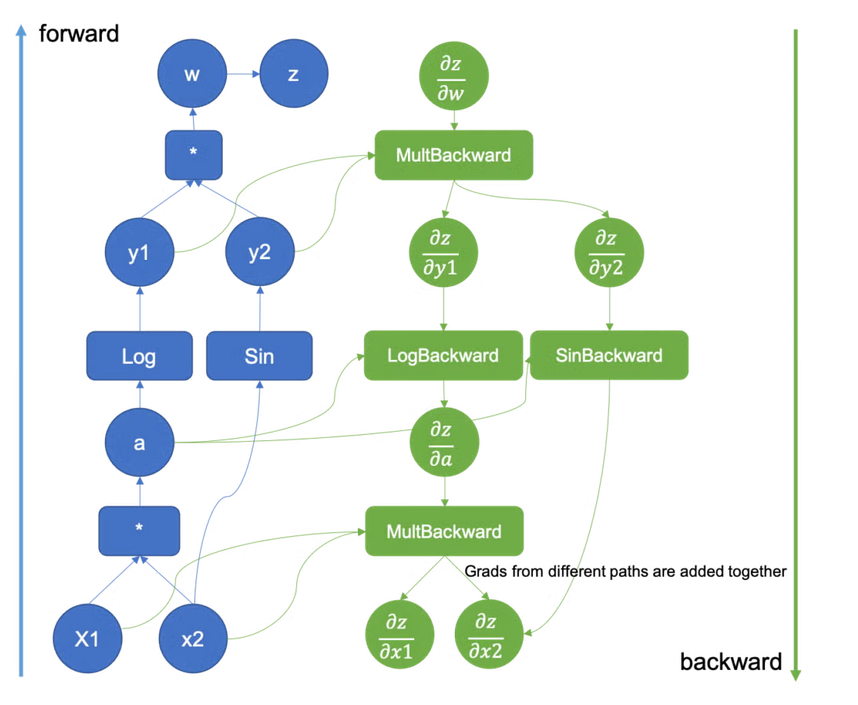

- Számítási gráf: DAG,
	- csúcsok: változók/számítások eredménye (levelek: a változók)
	- élek: műveletek
	- Amin van requires_grad=True, azt felrakja a gráfra, hogy tudjon majd gradienst számolni
	- ugyanazon az eszközön (GPU/CPU) kell lennie a tenzoroknak, amik ugyanabban a gráfban szerepelnek
- Előnyei:
	- dinamikus, tehát futás közben jön létre, így könnyebb vele kísérletezni. Nem kell futás előtt definiálni a gráfot.
	- különböző/dinamikusan változó dimenziójú/kimenetű adatokat könnyebb kezelni (pl NLP-ben)
	- egyszerűbb kód, a háttérben történik, így nem kel vele külön foglalkozni, csak simán kódot írni
	- egyszerűbb debug, kijön futásidőben

