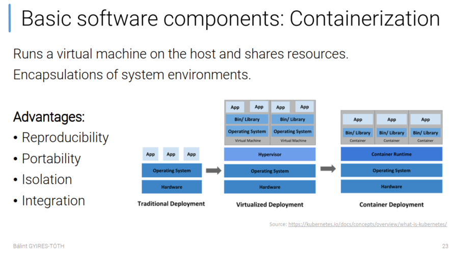
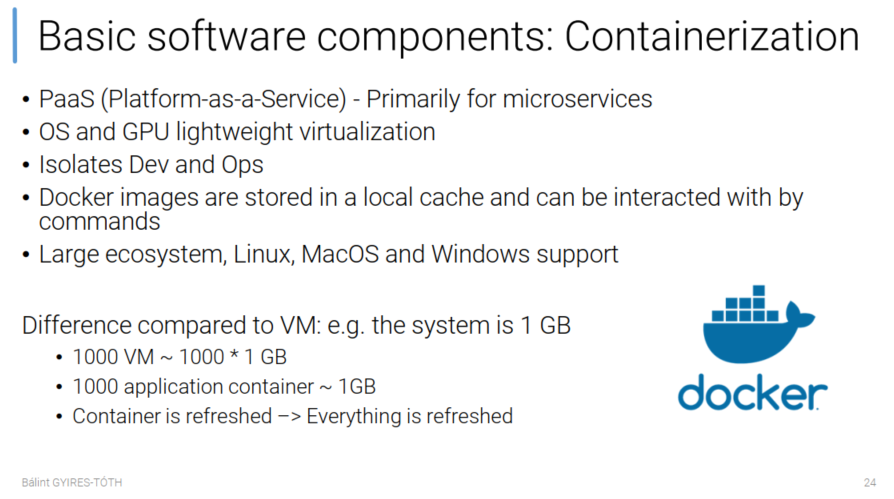

Miért fontos?
- Verziókat könnyebb befagyasztani, így könnyebb később futtatni ugyanazt a kísérletet vagy kész megoldást
	- Nem lesz gond azzal, hogy verziók összeakadnak, vagy esetleg kicsit más lenne másnál a környezet
	- Az összes függőséget bezárja egy helyre
- Könnyebb áthordozni máshová a konténert (pl. teszt környezetből a prodba)
- Skálázni könnyebb pl cloudban (AWS)
- Könnyebb verziózni magukat a konténereket is
- CI/CD folyamatokhoz, ami végül ugye MLOps lesz, automatizált model tanítás, teszt és deployment
- Alapvető előnyei a konténerizációnak: reprodukálhatóság, hordozhatóság, izoláció, integráció.
	- virtualizált környezet, de nem a teljes op rendszert virtualizálja, hanem egy szűkebb felső réteget

