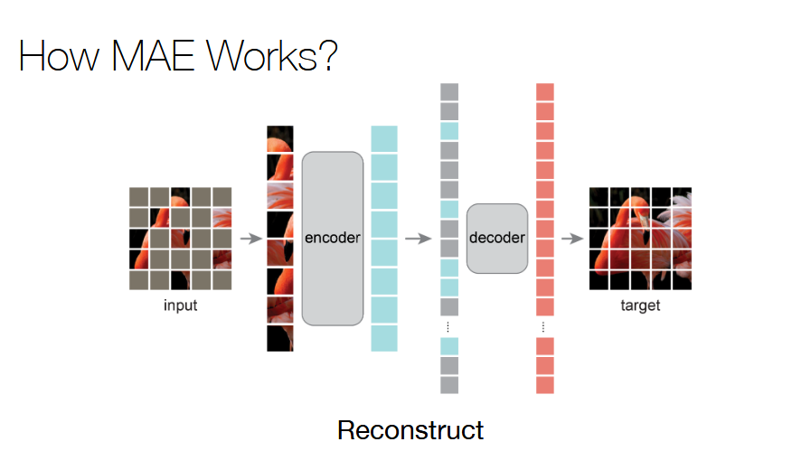

Self-supervised learning:
- Olyan feladat ahol nincsenek labelek (címkék), unlabeled az adat
- Tanítás:
	- Egy pretext taskon tanítjuk be a hálót self-supervised módon
	- Utána pedig egy downstream taskon továbbtanítjuk transfer learninggel, felhasználva a pretrained hálót
- Célja: előtanítani egy hálót, representation learning
- Előnyei:
	- Sok unlabeled adat olcsó (pl. szövegek, képek) szemben a címkézett adatokkal
	- új training célokat lehet használni a korábbi fixek helyett
	- Az ismert fix datasetek helyett újakat lehet használni
	- Pl. nagy modelleket rengeteg adaton be lehet tanítani, az overfitting félelme nélkül
- Vélemény:
	- Azért jó, mert így elő lehet tanítani egy modellt, ami egy általános reprezentációt tanul meg, kurva sok adatból, amit kvázi bárhonnan gyűjthetünk.

Pretext feladatok:
- Valami hidden property-jére tanul az adatnak a tanításkor
- NLP [link](https://amitness.com/posts/self-supervised-learning-nlp) példa:
	- Masked Language Modeling: a szöveg random szavait/tokenjeit kimaszoljuk, egy speciális [MASK] tokennel, a háló feladata, hogy prediktálja a kontextus alapján. BERT előtanításához használták.
	- Next Sentence Prediction: Két mondatot kap a modell (elválasztva egy speciális tokelnnel), a feladata eldönteni, hogy a két mondat egymást követi-e. BERT előtanításához használták.
	- Center Word Prediction: Adott k szó a szekvenciából, amiből fogjuk a középsőt, a kontextus (a maradék k-1 szó) alapján kell prediktálnia a középső szót a modellnek. Word2Vec tanításhoz használták.
- Vision példa [pl](https://icml.cc/media/icml-2023/Slides/21552.pdf):
	- Masked autoencoding (hasonlít a szöveges verzióra): kiszedünk darabokat a képből, encoder megkapja, maszkoljuk, majd ebből a decoder rekonstruálja. A masking ratio lehet elég magas is, pl 70-80(-90)%. BERT-like
	- Vision transformer valami
	- Ide kéne még egy amit meg is értek

