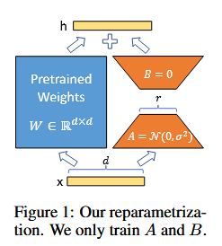

LoRA:
- Low Rank Adaptation
- LLM-eknél gyakran egy pretrained hálót finetune-olunk több különböző downstream taskra
- A finetuning problémája, hogy több (tíz/száz) milliárd paramétere lehet egy LLM-nek, amin ugyanúgy tanítani elég hosszadalmas. Eltárolni és deployolni a különböző tanított modelleket különböző downstream taskokra is elég erőforrás igényes.
- Megfigyelték (és feltételezték), hogy egy finetuning során alacsonyrangú a módosítás, amit a súlymátrixok kapnak ($\Delta W$), ezért felbontják két alacsonyrangú mátrix szorzatára ($\Delta W = BA$)
- Előny:
	- Kevesebb memória és storage használat, nem kell a optimizer state a befagyasztott (alap) rétegekre
	- Deployment során könnyebb a downstream takskok között váltani, mert a LORA súlyokat kell csak lecserélni és nem a teljes mátrixokat (az alap súlyok maradhatnak végig vramban)
	- Gyorsabb a tanítás, mint egy sima fine-tuningnál, mert nem kell olyan sok paraméterre gradienst számolni
	- A fenti még azt is jelenti, hogy kevesebb hardver is elég
	- Szemben más módszerekkel: adapter layerekkel szemben (beraknak a modellbe más rétegeket bizonyos helyekre)

