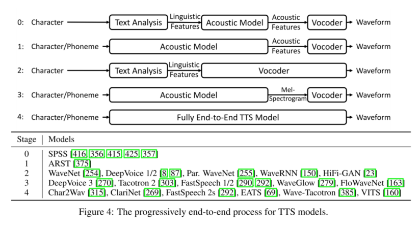

+ Fully-end-to-end esetében nincs semmilyen köztes reprezentáció
	Karakterekből rögtön waveform
+ Szövegfeldolgozás
	A szöveget normalizálja (pl számok, rövidítések feloldása), tokenizálja, (esetleg) fonémizálja
+ Akusztikai modell
	A fonémákat vagy szöveget valamilyen köztes akusztikai reprezentációra hozza pl Mel-spektogram
	Gyakran encoder-decoder architektúrájú
+ Vocoder
	A hanghullámot állítja elő a korábbi reprezentációból

A standard pipeline might look like:

1. **Text Normalization**: Converting raw text to spoken text (eg. "Mr." → "mister"). 
2. **Grapheme to Phoneme conversion (G2P)**: Convert basic units of text (ie. graphemes/characters) to basic units of spoken language (ie. phonemes).
3. **Spectrogram Synthesis**: Convert text/phonemes into a spectrogram.
4. **Audio Synthesis**: Convert spectrogram into audio. Also known as **spectrogram inversion**. Models which do this are called **vocoders**.

Teacher forcing (nem tudom ezt hova tegyem, de gondolom kell):
+ Tanítási technika szekvencia alapú modellekhez
+ a modell nem a saját előző predikcióját, hanem a helyes (ground truth) kimenetet kapja bemenetként a következő lépéshez
+ gyorsabb, stabilabb tanulás
+ drawback: nem látja a saját hibáit, inferencenél begyűrűzhet